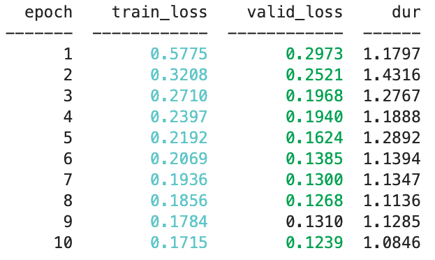

[.header: alignment(center), text-scale(1.5)]
[.text: alignment(center)]


# A Union of Scikit-learn and PyTorch

**Thomas J Fan**
Scikit-learn Developer @ DSI Columbia University

---


---


1. Scikit-Learn compatible neural network library that wraps PyTorch.
2. Abstracts away the training loop.
3. Reduces the amount of boilerplate code with callbacks.

---

# MNIST - Data


```python
print(X.shape, y.shape)
# (70000, 784) (70000,)
```

---

# MNIST - Data Code

[.code-highlight: all]
[.code-highlight: 3]
[.code-highlight: 5-6]

```python
from sklearn.model_selection import train_test_split

X_scaled = X / X.max()

X_train, X_test, y_train, y_test = train_test_split(
    X_scaled, y, test_size=0.25, random_state=42)
```

---

# MNIST - Neural Network Module

[.code-highlight: all]

```python
from torch.nn as nn

class SimpleFeedforward(nn.Module):
    def __init__(self):
        super().__init__()
        self.module = ...

    def forward(self, X):
        return self.module(X)
```


---


---

# MNIST - Loss function skorch

[.code-highlight: all]
[.code-highlight: 4]
[.code-highlight: 5]
[.code-highlight: 6-8]

```python
from skorch import NeuralNet

net = NeuralNet(
    SimpleFeedforward,
    criterion=nn.CrossEntropyLoss,
    max_epochs=10,
    lr=0.3,
    # device='cuda', # uncomment out to run on gpu
)
```

---

# MNIST - Fitting

```python
_ = net.fit(X_train, y_train)
```



---

# MNIST - Continue Training

```python
net.set_params(max_epochs=5)
_ = net.partial_fit(X_train, y_train)
```


---

# MNIST - History

[.code-highlight: all]
[.code-highlight: 1-2]
[.code-highlight: 4-5]
[.code-highlight: 7-10]

```python
len(net.history)
# 15

net.history[-1, 'valid_loss']
# 0.10163110941932314

net.history[-2:, 'train_loss']
# [0.1551400553612482,
#  0.1520235111486344,
#  0.15403895963941303]
```

---

# MNIST - Accuracy Score

[.code-highlight: all]

```python
from sklearn.metrics import make_scorer

def accuracy_argmax(y_true, y_pred):
    return np.mean(y_true == np.argmax(y_pred, axis=-1))

accuracy_argmax_scorer = make_scorer(accuracy_argmax)
```

---

# MNIST - EpochScoring and Checkpointing

[.code-highlight: all]
[.code-highlight: 3-6]
[.code-highlight: 8-9]
[.code-highlight: 5,8]

```python
from skorch.callbacks import EpochScoring

epoch_acc = EpochScoring(
    accuracy_argmax_scorer,
    name='valid_acc',
    lower_is_better=False)

cp = Checkpoint(monitor='valid_acc_best',
                dirname='exp_01')
```

---

# MNIST - Model Checkpointing

[.code-highlight: all]
[.code-highlight: 7]
[.code-highlight: 9]

```python
net = NeuralNet(
    SimpleFeedforward,
    criterion=nn.CrossEntropyLoss,
    max_epochs=10,
    lr=0.8,
    # device='cuda', # uncomment out to run on gpu
    callbacks=[epoch_acc, cp]
)
_ = net.fit(X, y)
```

---

# MNIST - Fitting With Callbacks


---

# MNIST - Prediction

[.code-highlight: all]
[.code-highlight: 1]
[.code-highlight: 3-5]

```python
net.load_params(checkpoint=cp)

y_pred = net.predict(X_test)
print('test accuracy:', accuracy_argmax(y_test, y_pred))
# test accuracy: 0.9645142857142858
```

---

# MNIST - Scikit-Learn Integration

[.code-highlight: all]
[.code-highlight: 1-6]
[.code-highlight: 8]

```python
from sklearn.pipeline import Pipeline
from sklearn.preprocessing import MinMaxScaler

pipe = Pipeline([
    ("min_max", MinMaxScaler()),
    ("net", net)])

_ = pipe.fit(X_train, y_train)
```

---

# Skorch - Closing

1. Scikit-Learn compatible neural network library that wraps PyTorch.
2. Abstracts away the training loop.
3. Reduces the amount of boilerplate code with callbacks.
  - `EpochScoring`
  - `Freezer`
  - `Checkpoint`
  - `LRScheduler`
  - [skorch.readthedocs.io/en/stable/user/callbacks.html](https://skorch.readthedocs.io/en/latest/user/callbacks.html)

---

# Skorch - Whats next


- [skorch.readthedocs.io](https://skorch.readthedocs.io/)
- [skorch Tutorials](https://skorch.readthedocs.io/en/latest/user/tutorials.html)
- [github.com/dnouri/skorch](https://github.com/dnouri/skorch)
- [github.com/thomasjpfan/python\_meetup\_feb\_19](https://github.com/thomasjpfan/python_meetup_feb_19)
